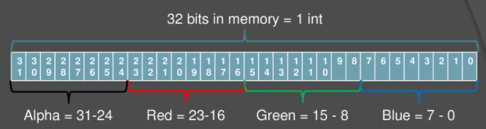

# Image Steganography

### Description
This project hides one file with any extension into a png image. This is done by encoding 1,2,4,or 8 bits from the file that needs to be hidden, into the lover 1,2,4 or 8 bits of each rgb value, respectively. 

### Technique 
There are 3, 8-bit fields in every rgb value, and they are store in an int like so (Image source: https://slideplayer.com/slide/14061668/):

Alpha filed is not used.

So, if we are encoding 2 bits that means per pixel we can encode **6 bits** (2 for r, 2 for g, 2 for b).

The format for the header is that the **first pixel** always contains the 2-bit encoding representing how many bits were encoded in the image. The **header** contains the int value representing how many bytes are encoded so that when the image is being decoded algorithm knows when to stop.

With this header design when decoding an encoded image there is no need to specify how many bits per pixel are encoded or how many total bytes are encoded.

### Examples
#### Hiding .txt Files
In the repo there are a few examples of this at work:

example.png was used to hide 4 different .txt files

**dexter.txt** was hidden in **example_e_1.png** using **1-bit encoding**.

**TheCallOfTheWind.txt** was hidden in **example_e_2.png** using **2-bit encoding**.

**Awakening.txt** was hidden in **example_e_4.png** using **4-bit encoding**.

**PaP.txt** was hidden in **example_e_8.png** using **8-bit encoding**.

All the files are available in the repository.

It is very hard to tell the difference between the original and 1 or 2-bit encoded image. The difference becomes easier to spot with 4-bit encoding, especially if we look at the sky.

Original:

4-bit encoding:

#### Hiding .png Files

Hidden files do not have to be .txt or text-based files. For example, you can hide an image inside an image. 

4k_image.png was used to hide 3 different .png files.

**SamplePNGImage_3mbmb.png** was hidden in **4k_e_1.png** using **1-bit encoding**.

**SamplePNGImage_5mbmb.png** was hidden in **4k_e_2.png** using **2-bit encoding**.

**SamplePNGImage_10mbmb.png** was hidden in **4k_e_4.png** using **4-bit encoding**.

All the files are available in the repository.

Once again, it is very hard to tell the difference between the original and 1 or 2-bit encoded image. The difference becomes easier to spot with 4-bit encoding. 

With **1-bit encoding** the maximum possible change in one of the colors is about **0.4%**.

With **2-bit encoding** the maximum possible change in one of the colors is about **1.2%**.

With **4-bit encoding** the maximum possible change in one of the colors is about **5.9%**.

As can be seen, for 1 and 2-bit encoding the changes are minor and very hard to notice, while the 4-bit encoding yields a significant possible change to the color.

### How to Run

Clone the repo and run Main.java from IDE (Requires Java Development Kit (JDK)).

The program is in command line, and will as you for inputs like the input png file, file to hide in the image, number of bits to encode etc.

